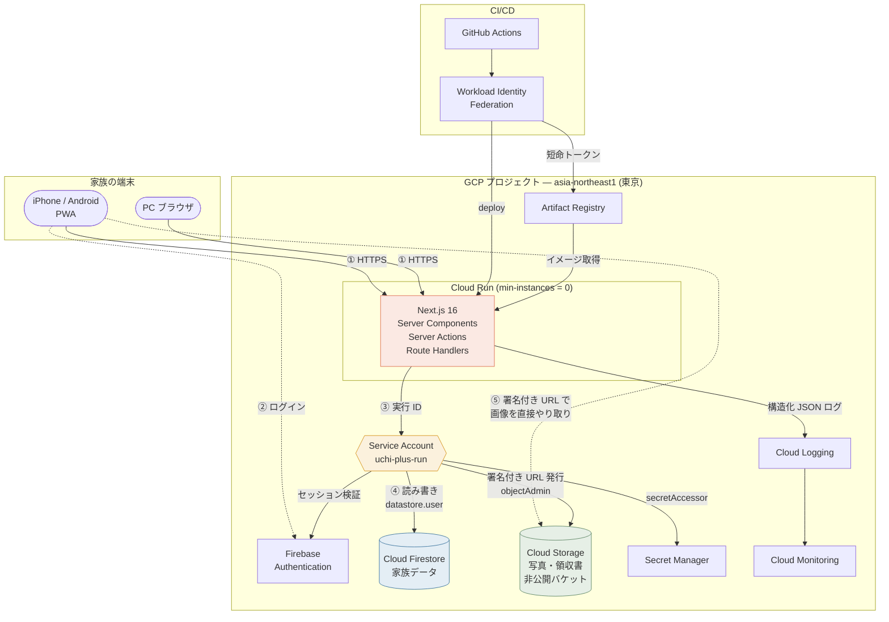
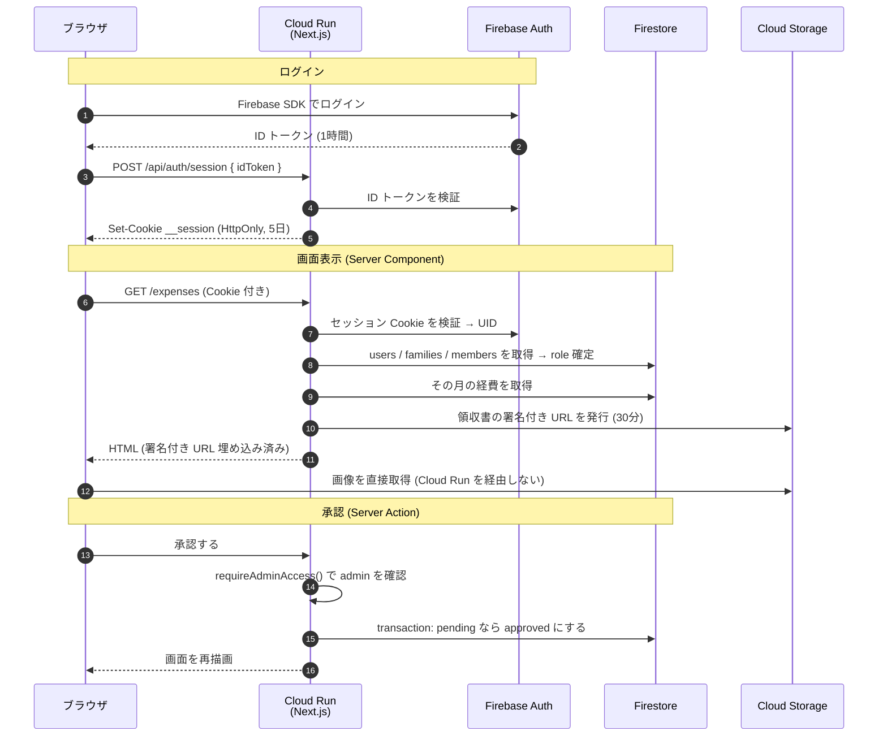
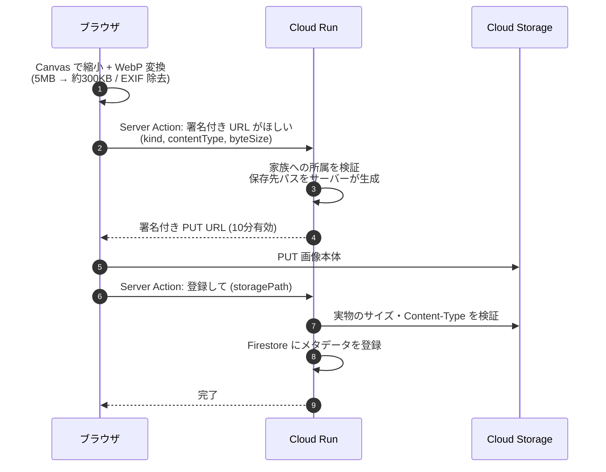

# UCHI+ (ウチプラス)

**家族のカレンダー・アルバム・経費申請をひとつにまとめた、家族専用のプライベート Web アプリ (PWA)。**

iPhone / Android / PC のブラウザから使えます。ホーム画面に追加すればアプリのように動きます。

このリポジトリには 2 つの目的があります。

1. **家族が毎日使えるアプリを完成させること**
2. **GCP の主要サービスを実践的に learn できる教材にすること**

そのため、コードとドキュメントには
「なぜこのサービスを選んだのか」「どこで課金が発生するのか」「どの権限が必要なのか」
を必ず書いています。GCP をはじめて触る方は
[docs/gcp-learning.md](./docs/gcp-learning.md) から読むのがおすすめです。

---

## 目次

- [できること](#できること)
- [アーキテクチャ](#アーキテクチャ)
- [使用している GCP サービス](#使用している-gcp-サービス)
- [Firestore データモデル](#firestore-データモデル)
- [Cloud Storage の構成](#cloud-storage-の構成)
- [セキュリティ設計](#セキュリティ設計)
- [IAM 構成](#iam-構成)
- [ローカル開発](#ローカル開発)
- [セットアップ (GCP プロジェクト作成から)](#セットアップ-gcp-プロジェクト作成から)
- [デプロイ](#デプロイ)
- [CI/CD](#cicd)
- [Logging](#logging)
- [Monitoring](#monitoring)
- [コスト](#コスト)
- [テスト](#テスト)
- [トラブルシューティング](#トラブルシューティング)
- [ディレクトリ構成](#ディレクトリ構成)
- [設計判断の記録 (ADR)](#設計判断の記録-adr)
- [未実装・今後の拡張](#未実装今後の拡張)

---

## できること

| 機能 | 内容 |
|------|------|
| **ホーム** | 今日の予定 / 今後の予定 / 承認待ち経費の件数 / 今月の承認済み合計 / 最近の写真 / 各機能へのショートカット |
| **家族カレンダー** | 月表示、日別の予定確認、作成・編集・削除、終日予定、場所、メモ、担当者 |
| **家族アルバム** | 複数枚アップロード、グリッド表示、アルバム分類、日付順表示、キャプション編集、削除 |
| **経費申請** | 下書き保存 → 申請 → 管理者が承認/却下。領収書の撮影・添付。取り下げ・再申請 |
| **経費集計** | 今月の承認済み / 承認待ち合計、カテゴリ別の内訳、月別の切り替え |
| **家族管理** | 家族の作成、招待コードによる参加、メンバー一覧、権限 (admin / member) の変更、メンバー削除 |
| **PWA** | ホーム画面に追加、スタンドアロン表示、オフライン時の案内 |

**権限**

| | admin (管理者) | member (メンバー) |
|---|---|---|
| カレンダーの利用 | ○ | ○ |
| 写真の利用 | ○ | ○ |
| 経費の申請 | ○ | ○ |
| **経費の承認・却下** | ○ | ✕ |
| **メンバー管理・招待コード発行** | ○ | ✕ |
| **家族設定の変更** | ○ | ✕ |

---

## アーキテクチャ



### リクエストの流れ



### 写真アップロードの流れ

Cloud Run を **画像が通らない** のが要点です。CPU 時間もリクエストサイズ上限も消費しません。



---

## 使用している GCP サービス

各サービスについて「役割 / なぜ使うのか / 代替 / このアプリでの使われ方」をまとめます。

### Cloud Run

| | |
|---|---|
| **役割** | Next.js アプリをコンテナとして実行する |
| **なぜ使うのか** | **min instances = 0 でゼロまでスケールする**ため、家族が使っていない時間 (1 日の大半) の課金がゼロになる。サーバーの管理・HTTPS 証明書・スケーリングがすべて不要 |
| **代替** | App Engine (Flexible は常時課金) / GKE (家族アプリには過剰、月 1 万円〜) / Vercel (GCP 学習にならない) |
| **このアプリでの使われ方** | すべての画面と Server Action。`asia-northeast1`、CPU 1 / メモリ 512Mi / 最大 3 インスタンス / concurrency 80。詳細は [ADR 002](./docs/adr/002-cloud-run.md) |

### Artifact Registry

| | |
|---|---|
| **役割** | Docker イメージの保管庫 |
| **なぜ使うのか** | Cloud Run はイメージを Artifact Registry (または GCR) から取得する。リポジトリ単位で IAM を設定でき、リージョンも選べる |
| **代替** | Container Registry (`gcr.io`、非推奨) / Docker Hub (GCP の IAM と統合されない、レート制限あり) |
| **このアプリでの使われ方** | GitHub Actions が `docker push`。イメージはコミット SHA でタグ付け。クリーンアップポリシーで直近 10 世代/30 日以内だけ保持 |

### Cloud Firestore

| | |
|---|---|
| **役割** | 家族・メンバー・予定・写真メタデータ・経費を保存する |
| **なぜ使うのか** | 従量課金でゼロスケールする。**Security Rules によるデータベース側の防御**が使える。家族 → 予定/写真/経費という階層構造と相性が良い |
| **代替** | Cloud SQL (常時課金 + アクセス制御を自作) / Realtime Database (クエリが弱い) / MongoDB Atlas (GCP 外) |
| **このアプリでの使われ方** | `families/{familyId}/` 配下に家族データを集約。サーバーからは Admin SDK、防御は Security Rules。詳細は [ADR 001](./docs/adr/001-firestore-vs-cloud-sql.md) |

### Firebase Authentication

| | |
|---|---|
| **役割** | ログイン (メール+パスワード / Google / メールリンク) |
| **なぜ使うのか** | 認証を自作すると必ず穴が空く。パスワードのハッシュ化・リセット・レート制限をすべて任せられる。**Firestore Security Rules で `request.auth.uid` がそのまま使える**のが決め手 |
| **代替** | Identity Platform (上位版。MFA/SAML が必要になったら移行) / Auth0 / NextAuth + 自前 DB |
| **このアプリでの使われ方** | Firebase UID をアプリ内部のユーザー ID として使用。ID トークン → セッション Cookie に交換。詳細は [ADR 004](./docs/adr/004-auth.md) |

### Cloud Storage

| | |
|---|---|
| **役割** | 写真と領収書の画像を保存する |
| **なぜ使うのか** | Firestore のドキュメント上限は 1MiB で写真が入らない。大きなファイルを安く置け、署名付き URL で細かくアクセス制御できる |
| **代替** | Firestore に Base64 (不可能) / 外部 CDN (アクセス制御が弱い) |
| **このアプリでの使われ方** | 非公開バケット。`families/{familyId}/photos|thumbnails|receipts/{uuid}.webp`。署名付き URL でブラウザと直接やり取り。詳細は [ADR 003](./docs/adr/003-storage.md) |

### Secret Manager

| | |
|---|---|
| **役割** | LINE のトークンなど秘密情報を保管する |
| **なぜ使うのか** | 環境変数に直接書くとリビジョン設定や Terraform state に平文で残る。バージョン管理・監査ログ・シークレット単位の IAM が使える |
| **代替** | 環境変数に直書き (履歴に残る) / KMS で暗号化して保存 (自前実装が増える) |
| **このアプリでの使われ方** | `LINE_CHANNEL_SECRET` / `LINE_CHANNEL_ACCESS_TOKEN` の入れ物を Terraform で作成。Cloud Run が環境変数として注入。取得は `src/lib/secrets/` |

### IAM

| | |
|---|---|
| **役割** | どのサービスアカウントがどの GCP リソースを操作できるかを決める |
| **なぜ使うのか** | 権限は「漏洩したときの被害の上限」を決める。最小権限にしておけば、アプリに脆弱性があっても被害を限定できる |
| **代替** | なし (GCP の基盤機能) |
| **このアプリでの使われ方** | アプリ用とデプロイ用でサービスアカウントを分離。Editor / Owner は付与しない。[IAM 構成](#iam-構成)を参照 |

### Cloud Logging

| | |
|---|---|
| **役割** | アプリのログを集約し、検索・フィルタできるようにする |
| **なぜ使うのか** | Cloud Run の標準出力が自動転送される。**JSON で出力すれば `severity` や `userId` で絞り込める** |
| **代替** | Datadog / New Relic (有料、家族アプリには過剰) |
| **このアプリでの使われ方** | `src/lib/logging/logger.ts` が構造化 JSON を出力。個人情報は自動で `[REDACTED]` |

### Cloud Monitoring

| | |
|---|---|
| **役割** | リクエスト数・レイテンシ・エラー率・インスタンス数を監視する |
| **なぜ使うのか** | 「壊れているのに気付かない」「知らないうちに課金が膨らむ」を防ぐ |
| **代替** | Uptime Robot などの外形監視 (Cloud Run の内部メトリクスは取れない) |
| **このアプリでの使われ方** | 5xx エラー率とインスタンス数のアラートを Terraform で定義 |

### GitHub Actions + Workload Identity Federation

| | |
|---|---|
| **役割** | push をトリガーにテスト → ビルド → Cloud Run へデプロイ |
| **なぜ使うのか** | **サービスアカウント鍵を GitHub に保存せずに済む。** GitHub の OIDC トークンを GCP が検証し、短命なアクセストークンに交換する |
| **代替** | Cloud Build ([選定理由](#なぜ-cloud-build-ではなく-github-actions-か)) / 手動デプロイ |
| **このアプリでの使われ方** | `.github/workflows/deploy.yml`。`attribute_condition` でリポジトリを固定 |

### 意図的に使っていないサービス

「GCP をたくさん使うこと」は目的ではありません。以下は**必要になるまで入れません**。

| サービス | 入れない理由 |
|---------|------------|
| GKE / Kubernetes | 家族 3 人のアプリに対して運用コストが釣り合わない (月 1 万円〜) |
| Pub/Sub | 非同期処理が現状ない。通知は同期で足りている |
| Cloud Tasks | 遅延実行・リトライが必要な処理がない |
| Memorystore (Redis) | キャッシュが必要なほどのアクセスがない。常時課金 |
| BigQuery | 分析要件がない。Firestore の集計で足りている |
| Cloud CDN | 画像は署名付き URL で GCS から直接配信しており、家族数人ではキャッシュの効果が薄い |
| Cloud Load Balancing | Cloud Run の標準 URL で足りる。LB は最低月 2,000 円程度かかる |

---

## Firestore データモデル

```
users/{userId}                                  ← Firebase UID
  ├── displayName, email, photoUrl
  ├── familyIds: [familyId, ...]                ← 所属家族 (非正規化)
  └── lastActiveFamilyId

inviteCodes/{code}                              ← 招待コード → familyId の逆引き
  ├── familyId, createdBy, createdAt
  └── expiresAt                                 (クライアントからは一切読めない)

families/{familyId}
  ├── name, createdBy, createdAt, updatedAt
  ├── inviteCode, inviteCodeExpiresAt
  ├── memberCount                               ← 非正規化
  │
  ├── members/{userId}                          ← ドキュメント ID = Firebase UID
  │     └── displayName, photoUrl, role, joinedAt
  │
  ├── events/{eventId}
  │     └── title, description, startAt, endAt, allDay,
  │         location, assignedUserId, createdBy, createdAt, updatedAt
  │
  ├── albums/{albumId}
  │     └── name, description, coverPhotoId, photoCount, createdBy, ...
  │
  ├── photos/{photoId}
  │     └── albumId, storagePath, thumbnailStoragePath, caption,
  │         takenAt, width, height, byteSize, contentType, uploadedBy, createdAt
  │
  └── expenses/{expenseId}
        └── applicantUserId, purchaseDate, yearMonth, merchant, amount,
            category, description, receiptStoragePath, status,
            adminComment, reviewedBy, reviewedAt, createdAt, updatedAt
```

### 設計の要点と、指定された構造から変更した点

**1. 家族データをすべて `families/{familyId}/` のサブコレクションに置いた**

Security Rules で `families/{familyId}` の階層に対して
「そのメンバーか」を 1 か所で判定できます。
クライアントが `familyId` を書き換えても、
その家族の `members/{自分の uid}` が存在しなければアクセスできません。
これが家族分離の根拠になっています。

**2. `photos` を `albums` のサブコレクションにしなかった** (変更点)

指定では `families/{familyId}/photos/{photoId}` でしたが、これをそのまま採用しています。
`albums/{albumId}/photos/{photoId}` にしなかった理由は 3 つです。

- 「アルバム未分類」の写真を置けなくなる
- 最も頻繁な操作である「家族の全写真を日付順に見る」に
  `collectionGroup` クエリが必要になり、Security Rules も書きづらくなる
- 写真をアルバム間で移動するのが「削除 + 再作成」になる

代わりに `photos.albumId` を持ち、複合インデックス
`(albumId ASC, takenAt DESC)` でアルバム別表示に対応しています。

**3. `expenses.yearMonth` を追加した** (変更点)

`"2026-09"` という文字列を書き込み時に確定させています。

- 月次集計を **範囲クエリではなく等価条件 1 つ**で引ける (インデックスが小さい)
- **タイムゾーンのバグを構造的に防げる**。
  JST 基準の月を書き込み時に 1 回だけ確定するので、
  「9/30 23:30 の買い物が 10 月に計上される」事故が起きません

**4. `users.familyIds` を非正規化した** (変更点)

ログイン直後に「この人はどの家族に所属しているか」を知る必要があります。
これを `collectionGroup('members').where('userId','==',uid)` で探すと
コストもインデックスも増えるため、ユーザードキュメントに配列で持たせています。

**重要**: この配列はクライアントから書き換えられません
(Security Rules で `users` への書き込みを全面的に禁止し、
サーバー経由でのみ更新しています)。書き換えられると任意の家族に「所属」できてしまいます。

**5. `inviteCodes` をトップレベルに置いた** (追加)

参加しようとしている人は、まだその家族のメンバーではないので
`families/{familyId}` を読めません。招待コードから家族を逆引きする必要があります。

このコレクションは **Security Rules で全面的に読み書き禁止** にしてあります。
読めると総当たりで家族 ID を収集できてしまうためです。
参加処理は Server Action (Admin SDK) だけが行います。

**6. `memberCount` / `photoCount` を非正規化した**

一覧表示のたびに数え直すと read が増えるため、
書き込み時に `FieldValue.increment()` で更新しています。

### 経費集計の設計判断

「クライアント集計 / aggregate query / 集計用ドキュメント」のうち、
**「その月の経費を 1 クエリで取得してサーバー側で合計する」** 方式を採用しました。

| 方式 | 採否 | 理由 |
|------|------|------|
| **都度集計** | **採用** | 常に正確。実装が単純。一覧表示に使うデータを使い回すので追加 read がゼロ |
| aggregate query (`count()`) | **部分採用** | 承認待ち件数 (全画面のバッジ) だけに使用。ドキュメントを読まないので安い |
| aggregate query (`sum()`) | 不採用 | 一覧表示にどのみち全件必要なので、別クエリを足すと逆にコストが増える |
| 集計用ドキュメント | 不採用 | 書き込みが重くなり、一度ズレると修復が面倒。家族規模では見合わない |

家族の経費は月に多くて数十件です。
Firestore の無料枠は 1 日 50,000 read なので、
経費画面を 1 日 100 回開いても無料枠の 6% 程度です。

**見直す条件**: 1 か月の経費が 1,000 件を超えたら集計用ドキュメントを検討します。
詳細は [ADR 006](./docs/adr/006-aggregation.md)。

### 複合インデックス

`firebase/firestore.indexes.json` で定義しています。
Firestore は「単一フィールドの並び替え」は自動でインデックスしますが、
**複数の条件を組み合わせるクエリには事前定義が必要** です。

| コレクション | フィールド | 用途 |
|------------|-----------|------|
| photos | albumId ASC, takenAt DESC | アルバム別の写真一覧 |
| expenses | yearMonth ASC, purchaseDate DESC | 月次の経費一覧 |
| expenses | yearMonth ASC, status ASC | 月別の承認済み合計 |
| expenses | status ASC, createdAt DESC | 承認待ち一覧 |
| expenses | applicantUserId ASC, createdAt DESC | 自分の経費一覧 |
| expenses | applicantUserId ASC, status ASC, createdAt DESC | 自分の経費をステータスで絞る |
| expenses | yearMonth ASC, status ASC, createdAt DESC | 月 + ステータスの一覧 |

---

## Cloud Storage の構成

### バケットとパス

```
gs://{PROJECT_ID}-media/                      ← 非公開バケット (公開設定を構成レベルで禁止)
└── families/
    ├── {familyId}/
    │   ├── photos/{uuid}.webp                ← 表示用 (長辺 1600px, 品質 0.82)
    │   ├── thumbnails/{uuid}.webp            ← 一覧用 (長辺 400px, 品質 0.7)
    │   └── receipts/{uuid}.webp              ← 領収書 (長辺 1400px, 品質 0.8)
    └── {別の familyId}/ ...
```

**パスは必ずサーバーが生成します** (`src/lib/storage/paths.ts`)。
クライアントが指定できるのは「写真か領収書か」だけで、
家族 ID とファイル名 (UUID) はサーバーが決めます。

ファイル名に元のファイル名を使わない理由:

- 元のファイル名に個人情報が含まれることがある (`田中家_2026年運動会.jpg`)
- 同名ファイルで上書きされる
- 推測できるファイル名は列挙攻撃の対象になる

### アップロードの制限

| 項目 | 値 | どこで検証するか |
|------|-----|----------------|
| 選択できる形式 | JPEG / PNG / WebP / HEIC / HEIF / GIF | ブラウザ (`accept` 属性) |
| 保存できる形式 | WebP / JPEG のみ | **サーバー** (署名前と、アップロード後の実物) |
| 元ファイルの上限 | 25MB | ブラウザ |
| 写真 (変換後) | 5MB | **サーバー** (署名前 + 実物検証) |
| サムネイル | 512KB | **サーバー** |
| 領収書 | 3MB | **サーバー** |
| 一度の枚数 | 20 枚 | ブラウザ |

**サーバーで 2 回検証しています。**

1. 署名付き URL を発行する前 — クライアントの申告値
2. アップロード完了後 — **Cloud Storage 上の実物のメタデータ**

2 が重要です。クライアントは「300KB の WebP です」と申告しながら
実際には別のものを PUT できるため、実物を確認してから Firestore に登録します。
サイズ超過や形式違反ならオブジェクトを削除して拒否します。

### EXIF の扱い

スマホの写真には **GPS 座標 (自宅の位置)** や端末情報が埋め込まれています。

UCHI+ ではブラウザの Canvas で再エンコードするため、
**アップロードされる画像から EXIF はすべて失われます**。
位置情報が Cloud Storage に保存されることはありません。

一方、失いたくない「撮影日時」だけは変換前に JPEG の APP1 セグメントから読み出し、
Firestore の `takenAt` に保存しています (`src/lib/images/exif.ts`)。

また `createImageBitmap(file, { imageOrientation: 'from-image' })` で
EXIF の回転情報を反映してから描画しているため、
iPhone の縦写真が横向きで保存されることもありません。

### 署名付き URL (Signed URL)

バケットは非公開なので、閲覧・アップロードには署名付き URL を使います。

| | アップロード | 閲覧 |
|---|------------|------|
| **メソッド** | PUT | GET |
| **有効期限** | **10 分** (`UPLOAD_URL_TTL_SECONDS`) | **30 分** (`SIGNED_URL_TTL_SECONDS`) |
| **発行場所** | Server Action `requestUploadTargetAction` | Server Component (ページ描画時) |
| **署名する内容** | パス + メソッド + Content-Type + 期限 | パス + メソッド + 期限 |
| **発行前の検証** | 家族への所属、サイズ、形式 | 家族への所属、領収書なら申請者本人か admin か |

**発行回数を抑える工夫**

- 一覧ではサムネイルのみ署名する (フル画像は詳細画面だけ)
- 発行済み URL をインスタンス内でメモリキャッシュし、期限の 60 秒前まで再利用する
  (`src/lib/storage/gcs.ts` の `readUrlCache`)

**署名に必要な IAM (最もハマるところ)**

Cloud Run の ADC には秘密鍵がありません。
そのためライブラリは **IAM Credentials API の `signBlob`** を使って署名します。

必要なもの:

1. サービスアカウント **自身に対する** `roles/iam.serviceAccountTokenCreator`
2. `iamcredentials.googleapis.com` の有効化

```hcl
# infra/terraform/service-accounts.tf
resource "google_service_account_iam_member" "app_token_creator" {
  service_account_id = google_service_account.app.name
  role               = "roles/iam.serviceAccountTokenCreator"
  member             = "serviceAccount:${google_service_account.app.email}"  # 自分自身
}
```

これが無いと `Permission 'iam.serviceAccounts.signBlob' denied` になります。

### CORS

ブラウザから署名付き URL へ直接アクセスするため、バケットに CORS 設定が必要です。

```bash
# infra/gcs-cors.json の origin を自分の Cloud Run URL に書き換えてから実行
gcloud storage buckets update gs://PROJECT_ID-media --cors-file=infra/gcs-cors.json
```

Terraform を使う場合は `infra/terraform/storage.tf` の `cors` ブロックが自動設定します
(`app_url` 変数を設定してください)。

### Storage Security Rules

`firebase/storage.rules` は **すべて拒否** にしています。

このアプリはブラウザから Firebase Storage SDK を使わず、
署名付き URL 経由でのみ Cloud Storage にアクセスするためです。
「使わない入口は閉じておく」という多層防御です。

**注意**: Storage Rules は `firebasestorage.googleapis.com` 経由のリクエストにのみ
適用されます。署名付き URL や GCS の JSON API には適用されません。
そちらは **バケットを非公開に保つこと** と **IAM** で守ります。

---

## セキュリティ設計

### 三層の防御

同じ判定を 3 か所に書いています。冗長ですが意図的です。

| 層 | 場所 | 何を守るか |
|----|------|-----------|
| **1. Firestore Security Rules** | `firebase/firestore.rules` | Firestore API への**直接アクセス** |
| **2. Server Action / Route Handler** | `src/lib/permissions/`, `src/lib/auth/session.ts` | アプリ経由の操作 |
| **3. UI** | 各コンポーネント | 誤操作の防止 (**防御ではない**) |

UI の出し分けは防御ではありません。
`session.role === 'admin'` は DevTools で書き換えられます。だから 1 と 2 が必要です。

### なぜ Security Rules が必要なのか

このアプリは Firestore の読み書きをすべてサーバー (Admin SDK) 経由で行います。
「ならば Security Rules は不要では?」と思えますが、**必要です。**

Firestore は **インターネットに直接公開された API** です。
ログイン済みの家族の 1 人がブラウザの DevTools で ID トークンを取り出せば、
このアプリを一切通さずに Firestore を叩けます。

```js
// 悪意あるメンバーがブラウザのコンソールで実行できてしまうこと
await fetch('https://firestore.googleapis.com/v1/projects/.../documents/families/他人の家族/expenses',
  { headers: { Authorization: `Bearer ${idToken}` } });
```

このとき唯一の防御が Security Rules です。

### Security Rules が保証していること

`firebase/firestore.rules` で以下を保証し、`tests/rules/` で **62 件のテスト**で検証しています。

| 保証 | ルール上の実装 |
|------|--------------|
| 未ログインは一切アクセス不可 | `request.auth != null` をすべての判定の前提にする |
| 所属外の家族のデータは読めない | `exists(families/$(familyId)/members/$(uid))` |
| **familyId を偽装しても別家族に届かない** | **パス上の familyId** に対してメンバーシップを確認する |
| member は admin 専用操作ができない | `memberRole(familyId) == 'admin'` |
| **経費の承認は admin のみ、かつ pending からのみ** | `isAdmin() && resource.data.status == 'pending'` |
| 審査者を詐称できない | `request.resource.data.reviewedBy == request.auth.uid` |
| 承認時に金額を改ざんできない | `changedKeysWithin(['status','adminComment','reviewedBy','reviewedAt','updatedAt'])` |
| 申請済みは申請者でも編集不可 | `resource.data.status in ['draft','rejected']` |
| 自分で status を approved にできない | `request.resource.data.status in ['draft','pending']` |
| 承認済みは誰も削除できない | `resource.data.status != 'approved'` |
| 管理者が 0 人にならない | `memberId != uid()` (自分の降格・削除を禁止) |
| 招待コードは総当たりできない | `inviteCodes` は読み書き全面禁止 |
| familyIds を自分で書き換えられない | `users` への書き込みを全面禁止 |
| 写真の保存先を偽装できない | `storagePath.matches('^families/' + familyId + '/photos/...')` |
| 未定義パスはすべて拒否 | 最後に `match /{document=**} { allow read, write: if false; }` |

### 実装しているセキュリティ対策

| 対策 | 実装 |
|------|------|
| **Firebase Auth トークン検証** | `verifySessionCookie(cookie, true)` — `checkRevoked=true` で失効済みも弾く |
| **セッションの安全な保管** | `HttpOnly` + `Secure` (本番) + `SameSite=Lax` Cookie。localStorage に置かない |
| **XSS** | React の自動エスケープ。`dangerouslySetInnerHTML` を一切使っていない。CSP 相当のヘッダを `next.config.ts` で付与 |
| **CSRF** | `SameSite=Lax` / Server Actions の Origin 検証 (Next.js 内蔵) / `/api/auth/session` で Origin を明示検証 |
| **入力検証** | Zod スキーマをクライアントと **サーバーの両方** で実行 (`src/lib/validation/`) |
| **ファイル MIME 検証** | 保存できるのは WebP / JPEG のみ。**GCS 上の実物のメタデータ**を確認 |
| **ファイルサイズ制限** | 種別ごとに上限。署名前と実物の 2 回チェック |
| **ランダムなファイル名** | `crypto.randomUUID()`。元のファイル名を使わない |
| **familyId の検証** | すべての Server Action で `requireFamilyAccess(familyId)` を通す |
| **admin ロールの検証** | `requireAdminAccess(familyId)` + トランザクション内での再確認 |
| **IDOR 対策** | すべてのデータ取得を `families/{自分の familyId}/...` スコープで行う。他家族の ID を渡しても「見つからない」になる |
| **パス・トラバーサル対策** | `..` と `//` を拒否、正規表現で形式を固定 (`isPathOwnedByFamily`) |
| **前方一致の悪用対策** | `families/fam1/` のように末尾スラッシュ付きで比較 (`fam12` が `fam1` にマッチしない) |
| **秘密情報の分離** | Secret Manager。サービスアカウント鍵をリポジトリに置かない (`.gitignore` 済み) |
| **最小権限** | Editor / Owner を付与しない。バケット・シークレット単位で権限を絞る |
| **ログの安全性** | パスワード・トークン・メール・署名付き URL を自動で `[REDACTED]` |
| **クリックジャッキング** | `X-Frame-Options: DENY` |
| **MIME スニッフィング** | `X-Content-Type-Options: nosniff` |
| **検索エンジン対策** | `robots: { index: false }` — 家族専用アプリなのでインデックスさせない |

### レート制限 (将来の拡張)

現状はレート制限を実装していません。家族数人の利用では不要なためです。
必要になった場合は以下の順で検討します。

1. **Cloud Armor** — Cloud Run の前段に置く (要ロードバランサ、月 2,000 円程度)
2. **アプリ内でのカウント** — Firestore に試行回数を記録
3. **Firebase App Check** — 正規のアプリからのリクエストか検証

なお、ログインの総当たりは **Firebase Authentication が標準でレート制限** しています。

### セキュリティ上の注意点 (運用時)

- **招待コードを SNS に貼らない。** 10 桁 (32^10 通り) で推測は困難ですが、
  漏れたら誰でも家族に参加できます。使い終わったら設定画面から再発行してください
- **Cloud Run の URL は公開されています。** URL を知られても
  ログイン画面しか見えませんが、URL 自体を広めないでください
- **Firebase の API キーに HTTP リファラー制限をかける。**
  Google Cloud コンソール →「APIとサービス」→「認証情報」から設定できます
- **バケットに `allUsers` を絶対に付けない。**
  Terraform では `public_access_prevention = "enforced"` で構成レベルで禁止しています
- **サービスアカウント鍵を作らない。** ADC と WIF で完結します

---

## IAM 構成

### サービスアカウントを 2 つに分ける理由

アプリが乗っ取られてもデプロイはできず、CI が漏洩しても家族の写真は読めません。
**被害範囲を切り分ける** のが目的です。

### 1. アプリ実行用: `uchi-plus-run@PROJECT_ID.iam.gserviceaccount.com`

Cloud Run のリビジョンがこのサービスアカウントとして動きます。

| ロール | スコープ | なぜ必要か | なぜこれ以上広げないか |
|--------|---------|-----------|---------------------|
| `roles/datastore.user` | プロジェクト | Firestore の読み書き | `datastore.owner` はインデックス操作やインポート/エクスポートもできてしまう |
| `roles/storage.objectAdmin` | **バケットのみ** | 写真の作成・読み取り・削除、署名付き URL の生成 | プロジェクト全体に付けると他のバケットも操作できてしまう。`objectViewer` では削除できず、`objectCreator` では読めない |
| `roles/secretmanager.secretAccessor` | **各シークレットのみ** | LINE トークンの取得 | プロジェクト全体に付けると将来追加する全シークレットを読めてしまう |
| `roles/logging.logWriter` | プロジェクト | 構造化ログの出力 | 書き込みのみ。`logging.admin` はログの削除もできてしまう |
| `roles/monitoring.metricWriter` | プロジェクト | カスタムメトリクスの送信 (将来用) | 書き込みのみ |
| `roles/firebaseauth.admin` | プロジェクト | セッション Cookie の発行、ユーザー情報の参照 | これより狭い定義済みロールが存在しない。さらに絞るならカスタムロールを検討 |
| `roles/iam.serviceAccountTokenCreator` | **自分自身** | 署名付き URL の生成 (`signBlob`) | 他のサービスアカウントに対しては付けない |

**付与しないもの**: `roles/editor`, `roles/owner`, `roles/storage.admin`,
`roles/datastore.owner`, `roles/secretmanager.admin`

### 2. デプロイ用: `uchi-plus-deployer@PROJECT_ID.iam.gserviceaccount.com`

GitHub Actions が Workload Identity Federation を通じて借ります。

| ロール | スコープ | なぜ必要か |
|--------|---------|-----------|
| `roles/artifactregistry.writer` | プロジェクト | Docker イメージの push |
| `roles/run.admin` | プロジェクト | Cloud Run サービスの更新 |
| `roles/iam.serviceAccountUser` | **app SA に対して** | Cloud Run を app SA として実行するために必要 |
| `roles/firebaserules.admin` | プロジェクト | Security Rules のデプロイ |
| `roles/datastore.indexAdmin` | プロジェクト | Firestore インデックスのデプロイ |

**このサービスアカウントは家族のデータを読めません。**
`datastore.user` も `storage.objectViewer` も付けていないためです。

### 3. Workload Identity Pool

| 設定 | 値 | 意味 |
|------|-----|------|
| Issuer | `https://token.actions.githubusercontent.com` | GitHub の OIDC 発行者 |
| **Attribute condition** | `attribute.repository == 'owner/repo'` | **これが無いと世界中の GitHub リポジトリから使われる** |
| Principal | `principalSet://.../attribute.repository/owner/repo` | このリポジトリだけが deployer SA を借りられる |

---

## ローカル開発

### 必要なもの

| ツール | バージョン | 用途 |
|--------|-----------|------|
| Node.js | **22 以上** | アプリの実行 |
| npm | 10 以上 | パッケージ管理 |
| **JDK** | **21 以上** | Firebase Emulator (Java 製) の実行 |
| Docker | 任意 | イメージのビルド検証 |

> **JDK について**
> Firebase CLI v15 以降は JDK 21 以上を要求します。
> macOS なら `brew install openjdk@21` を実行してください。
> `JAVA_HOME` の設定は不要です — `scripts/find-java.sh` が
> Homebrew の場所や `/usr/libexec/java_home` を順に探して自動で設定します
> (keg-only なのでシステムの既定 Java は変わりません)。

### 手順

**1 コマンドで全部立ち上がります。**

```bash
npm install
npm run dev:local
```

`npm run dev:local` がやること:

1. `.env.local` が無ければ `.env.example` から作成
2. JDK 21+ を自動的に探して `JAVA_HOME` を設定
3. Firebase Emulator (Auth / Firestore / Storage) を起動
4. 起動を待って、**初回のみ**シードデータを投入
5. Next.js の開発サーバーを起動

`Ctrl+C` でエミュレータごとまとめて終了します。

```
  ────────────────────────────────────────────────
   UCHI+ ローカル開発環境

   アプリ          http://localhost:3000
   Emulator UI     http://127.0.0.1:4000
  ────────────────────────────────────────────────
```

シードデータを入れ直したいときは:

```bash
npm run dev:local -- --seed     # 起動と同時に入れ直す
npm run seed                    # 起動中に別ターミナルから入れ直す
```

> シードは**何度実行しても同じ状態**になります (シード用の家族データを消してから作り直すため)。
> 手で作ったデータは、シード用の家族 (`seed-family-yamada`) 以外なら残ります。

### 個別に起動したい場合

```bash
# ターミナル 1: エミュレータ
npm run emulators

# ターミナル 2: シードデータ
npm run seed

# ターミナル 3: 開発サーバー
npm run dev
```

### シードデータでログインする

| 表示名 | メールアドレス | パスワード | 権限 |
|--------|--------------|-----------|------|
| おとうさん | `dad@example.com` | `password123` | admin |
| おかあさん | `mom@example.com` | `password123` | admin |
| はなこ | `kid@example.com` | `password123` | member |

招待コード: `YAMADA2026`

シードデータには、予定 6 件、写真 6 枚 (アルバム 1 件)、
経費 6 件 (draft / pending / approved / rejected をすべて含む) が入っています。

### 動作確認チェックリスト

ブラウザで一通り触って確認する手順です。
**権限の違いを見るために、admin と member の 2 つのアカウントを使い分けてください**
(シークレットウィンドウを使うと 2 つ同時にログインできます)。

**基本 — おとうさん (admin) でログイン**

- [ ] `http://localhost:3000` を開き、`dad@example.com` / `password123` でログイン
- [ ] ホームに「今日の予定」「承認待ち 1 件」「今月の承認済み合計」「最近の写真」が出る
- [ ] カレンダーで予定のある日に点が付き、日付をタップすると下に一覧が出る
- [ ] 「+ 予定を追加」で予定を作れる。終日にすると入力欄が日付だけに変わる
- [ ] アルバムで写真が日付ごとにまとまって表示される。写真をタップすると拡大される
- [ ] 経費一覧に 6 件出て、カテゴリ別の内訳バーが表示される
- [ ] 承認待ちの経費を開くと**領収書の画像**が見え、「承認 / 却下」フォームがある
- [ ] 承認するとステータスが「承認済み」になり、審査者とコメントが記録される
- [ ] 設定に**招待コード `YAMADA2026`** が表示され、タップでコピーできる
- [ ] 設定でメンバーの「管理者に / 一般に」「削除」ボタンが出る

**権限 — はなこ (member) でログイン**

- [ ] 設定に**招待コードが表示されない**
- [ ] 設定にメンバーの権限変更・削除ボタンが**出ない**
- [ ] `http://localhost:3000/expenses/review` を直接開くと**経費一覧にリダイレクトされる**
- [ ] 承認待ちの経費を開いても「承認 / 却下」フォームが**出ない**
- [ ] 自分で経費を作成 →「申請する」→ ステータスが「承認待ち」になる
- [ ] 申請済みの経費に「編集する」ボタンが**出ない**(「申請を取り下げる」は出る)
- [ ] 取り下げると「下書き」に戻り、編集できるようになる

**アップロード (実機で試すと分かりやすい)**

- [ ] アルバムで「写真を追加」→ 複数選択 → 進捗バーが出て順に登録される
- [ ] 経費作成で「領収書を撮影 / 選択」→ プレビューが出る
- [ ] Emulator UI (`http://127.0.0.1:4000`) の Storage タブに
      `families/.../photos/{UUID}.webp` として保存されているのが見える
      (元のファイル名ではなく UUID になっていること、サイズが圧縮されていること)

**PWA (スマホで確認)**

- [ ] 同じ Wi-Fi のスマホから `http://<PCのIP>:3000` を開く
      (起動時に表示される `Network:` の URL)
- [ ] 下部にボトムナビが出て、片手で操作できる
- [ ] PC ブラウザでウィンドウを広げるとサイドバーに切り替わる

> **注意**: スマホからの「ホーム画面に追加」は HTTPS が必要なため、
> ローカルの HTTP では PWA としてインストールできません。
> インストールの確認は Cloud Run へデプロイした後に行ってください。
> (画面のレイアウト自体はローカルでも確認できます)

**Emulator UI で中身を見る**

`http://127.0.0.1:4000` を開くと、

- **Authentication** タブ: 作成されたユーザー
- **Firestore** タブ: `families/{familyId}/expenses/...` のデータ構造
- **Storage** タブ: 保存された画像

が見えます。**アプリの画面と Firestore のドキュメントを見比べる**と、
データモデルの理解が早いです。

### エミュレータ利用時の違い

Storage エミュレータは署名付き URL に対応していません。そのため、

- アップロード: `/api/dev-upload` (アプリ内のエンドポイント) を経由
- 閲覧: `/api/media` でアプリがバイト列を返す

これらのエンドポイントは **`USE_FIREBASE_EMULATORS=true` のときだけ有効** で、
本番では 404 を返します。

### よく使うコマンド

```bash
npm run dev              # 開発サーバー
npm run build            # 本番ビルド
npm run start            # 本番ビルドを起動
npm run lint             # ESLint
npm run typecheck        # tsc --noEmit
npm test                 # ユニットテスト (エミュレータ不要)
npm run test:rules       # Security Rules テスト (エミュレータを自動起動)
npm run test:integration # データ層の統合テスト (エミュレータを自動起動)
npm run test:all         # 全テスト
npm run emulators        # Firebase Emulator 起動
npm run seed             # シードデータ投入
npm run docker:build     # Docker イメージのビルド
```

---

## セットアップ (GCP プロジェクト作成から)

はじめて GCP を触る方でも進められるよう、順を追って説明します。
所要時間は 30〜60 分程度です。

以下では例として `uchi-plus-prod` というプロジェクト ID を使います。
実際には **全世界で一意** である必要があるので、`uchi-plus-yamada-2026` のように
自分だけの名前を付けてください。

### 事前準備

```bash
# gcloud CLI をインストールする
#   https://cloud.google.com/sdk/docs/install
gcloud --version

# Google アカウントでログインする
gcloud auth login
```

### 1. GCP プロジェクトを作成する

```bash
export PROJECT_ID="uchi-plus-prod"     # 自分の名前に変更してください
export REGION="asia-northeast1"

gcloud projects create "$PROJECT_ID" --name="UCHI+"
gcloud config set project "$PROJECT_ID"
```

コンソールから作る場合: https://console.cloud.google.com/projectcreate

### 2. 課金アカウントを紐付ける

**課金を有効にしないと、ほとんどの API が使えません。**
無料枠の範囲なら請求は発生しませんが、紐付け自体は必要です。

```bash
# 利用可能な課金アカウントを確認する
gcloud billing accounts list

# 紐付ける
gcloud billing projects link "$PROJECT_ID" --billing-account=XXXXXX-XXXXXX-XXXXXX
```

> **予算アラートを必ず設定してください。**
> コンソール →「お支払い」→「予算とアラート」から、
> 月 1,000 円などの予算としきい値 (50% / 90% / 100%) を設定しておくと、
> 想定外の課金にすぐ気付けます。無料で設定できます。

### 3. 必要な API を有効化する

```bash
gcloud services enable \
  run.googleapis.com \
  artifactregistry.googleapis.com \
  firestore.googleapis.com \
  firebase.googleapis.com \
  identitytoolkit.googleapis.com \
  storage.googleapis.com \
  secretmanager.googleapis.com \
  iamcredentials.googleapis.com \
  logging.googleapis.com \
  monitoring.googleapis.com \
  cloudresourcemanager.googleapis.com \
  iam.googleapis.com \
  sts.googleapis.com \
  --project="$PROJECT_ID"
```

> `iamcredentials.googleapis.com` は **署名付き URL の生成に必須** です。
> 忘れると写真の表示・アップロードが失敗します。

### 4. Firebase をプロジェクトに追加する

Firebase Authentication を使うために、GCP プロジェクトに Firebase を有効化します。

1. https://console.firebase.google.com/ を開く
2. 「プロジェクトを追加」→「**既存の Google Cloud プロジェクトを選択**」
3. 作成した `uchi-plus-prod` を選ぶ
4. Google Analytics は **不要** (家族アプリなので無効でよい)

次に **Web アプリ** を登録します。

1. プロジェクトの概要 → 「</>」(ウェブ) アイコン
2. アプリのニックネーム: `UCHI+ Web`
3. 「Firebase Hosting も設定する」は **チェックしない** (Cloud Run を使うため)
4. 表示される設定値を控える

```js
const firebaseConfig = {
  apiKey: "AIzaSy...",                          // → FIREBASE_API_KEY
  authDomain: "uchi-plus-prod.firebaseapp.com", // → FIREBASE_AUTH_DOMAIN
  projectId: "uchi-plus-prod",                  // → FIREBASE_PROJECT_ID
  storageBucket: "...",                         // (使わない。GCS_BUCKET を別途指定)
  messagingSenderId: "123456789012",            // → FIREBASE_MESSAGING_SENDER_ID
  appId: "1:123456789012:web:abcdef"            // → FIREBASE_APP_ID
};
```

> **apiKey は秘密情報ではありません。** ブラウザに配られる前提の識別子です。
> アクセス制御は Firebase Authentication と Security Rules が行います。
> ただし「APIとサービス」→「認証情報」から
> **HTTP リファラー制限** をかけておくことを推奨します。

### 5. Authentication を設定する

Firebase コンソール → **Authentication** → 「始める」

**Sign-in method** で以下を有効にします。

| プロバイダ | 設定 |
|-----------|------|
| **メール / パスワード** | 有効にする。さらに「**メールリンク (パスワードなしでログイン)**」も有効にする |
| **Google** | 有効にする。プロジェクトのサポートメールを選択 |

**Settings** → **承認済みドメイン** に、Cloud Run の URL のホスト名を追加します。

```
uchi-plus-xxxxxxxxxx-an.a.run.app
```

> これを忘れると `auth/unauthorized-domain` エラーで Google ログインが失敗します。
> Cloud Run の URL は最初のデプロイ後に決まるので、**手順 13 の後で追加**してください。

### 6. Firestore を作成する

```bash
gcloud firestore databases create \
  --location="$REGION" \
  --type=firestore-native \
  --project="$PROJECT_ID"
```

コンソールから作る場合は Firebase コンソール → Firestore Database →
「データベースの作成」→ **本番環境モード** → ロケーション `asia-northeast1`。

> **ロケーションは後から変更できません。** 慎重に選んでください。
> 「本番環境モード」を選ぶと初期ルールが「全拒否」になります。
> このあと自分のルールをデプロイするので問題ありません。

### 7. Cloud Storage バケットを作成する

```bash
export BUCKET="${PROJECT_ID}-media"

gcloud storage buckets create "gs://${BUCKET}" \
  --location="$REGION" \
  --uniform-bucket-level-access \
  --public-access-prevention \
  --project="$PROJECT_ID"
```

| オプション | 意味 |
|-----------|------|
| `--uniform-bucket-level-access` | オブジェクト単位の ACL を無効化。うっかり公開する事故を防ぐ |
| `--public-access-prevention` | 公開設定を構成レベルで禁止する |

**CORS を設定します** (ブラウザから署名付き URL へ直接アクセスするため)。

```bash
# infra/gcs-cors.json の origin を自分の URL に書き換えてから
gcloud storage buckets update "gs://${BUCKET}" --cors-file=infra/gcs-cors.json
```

### 8. Artifact Registry のリポジトリを作成する

```bash
gcloud artifacts repositories create uchi-plus \
  --repository-format=docker \
  --location="$REGION" \
  --description="UCHI+ のコンテナイメージ" \
  --project="$PROJECT_ID"

# ローカルの Docker から push できるように認証を設定する
gcloud auth configure-docker "${REGION}-docker.pkg.dev"
```

### 9. サービスアカウントを作成する

```bash
# アプリ実行用
gcloud iam service-accounts create uchi-plus-run \
  --display-name="UCHI+ Cloud Run runtime" \
  --project="$PROJECT_ID"

# デプロイ用 (GitHub Actions が借りる)
gcloud iam service-accounts create uchi-plus-deployer \
  --display-name="UCHI+ GitHub Actions deployer" \
  --project="$PROJECT_ID"

export APP_SA="uchi-plus-run@${PROJECT_ID}.iam.gserviceaccount.com"
export DEPLOY_SA="uchi-plus-deployer@${PROJECT_ID}.iam.gserviceaccount.com"
```

### 10. IAM ロールを付与する

```bash
# ---- アプリ実行用 SA ----
for ROLE in \
  roles/datastore.user \
  roles/logging.logWriter \
  roles/monitoring.metricWriter \
  roles/firebaseauth.admin
do
  gcloud projects add-iam-policy-binding "$PROJECT_ID" \
    --member="serviceAccount:${APP_SA}" --role="$ROLE" --condition=None
done

# バケット単位で付与する (プロジェクト全体には付けない)
gcloud storage buckets add-iam-policy-binding "gs://${BUCKET}" \
  --member="serviceAccount:${APP_SA}" --role="roles/storage.objectAdmin"

# 署名付き URL の生成に必要 (自分自身に対して付与する)
gcloud iam service-accounts add-iam-policy-binding "$APP_SA" \
  --member="serviceAccount:${APP_SA}" \
  --role="roles/iam.serviceAccountTokenCreator" \
  --project="$PROJECT_ID"

# ---- デプロイ用 SA ----
for ROLE in \
  roles/artifactregistry.writer \
  roles/run.admin \
  roles/firebaserules.admin \
  roles/datastore.indexAdmin
do
  gcloud projects add-iam-policy-binding "$PROJECT_ID" \
    --member="serviceAccount:${DEPLOY_SA}" --role="$ROLE" --condition=None
done

# Cloud Run を app SA として動かすために必要
gcloud iam service-accounts add-iam-policy-binding "$APP_SA" \
  --member="serviceAccount:${DEPLOY_SA}" \
  --role="roles/iam.serviceAccountUser" \
  --project="$PROJECT_ID"
```

> **Editor や Owner は絶対に付けないでください。**
> 権限は「漏洩したときの被害の上限」を決めます。

### 11. Secret Manager にシークレットを登録する

LINE 連携を使わない場合はこの手順を飛ばして構いません
(その場合は `.github/workflows/deploy.yml` の `secrets:` ブロックを削除してください)。

```bash
# 入れ物を作る
gcloud secrets create LINE_CHANNEL_ACCESS_TOKEN \
  --replication-policy="user-managed" --locations="$REGION" --project="$PROJECT_ID"
gcloud secrets create LINE_CHANNEL_SECRET \
  --replication-policy="user-managed" --locations="$REGION" --project="$PROJECT_ID"

# 値を登録する
echo -n "実際のトークン" | \
  gcloud secrets versions add LINE_CHANNEL_ACCESS_TOKEN --data-file=- --project="$PROJECT_ID"

# アプリ SA に、このシークレットだけの読み取り権限を付ける
for SECRET in LINE_CHANNEL_ACCESS_TOKEN LINE_CHANNEL_SECRET; do
  gcloud secrets add-iam-policy-binding "$SECRET" \
    --member="serviceAccount:${APP_SA}" \
    --role="roles/secretmanager.secretAccessor" --project="$PROJECT_ID"
done
```

### 12. Workload Identity Federation の設定

GitHub Actions が **鍵ファイルなしで** GCP を操作できるようにします。

```bash
export GITHUB_REPO="your-name/uchi-plus"   # 自分のリポジトリに変更
export PROJECT_NUMBER=$(gcloud projects describe "$PROJECT_ID" --format='value(projectNumber)')

# 1. Workload Identity Pool を作る
gcloud iam workload-identity-pools create github-pool \
  --location=global --display-name="GitHub Actions" --project="$PROJECT_ID"

# 2. GitHub の OIDC プロバイダを登録する
gcloud iam workload-identity-pools providers create-oidc github-provider \
  --location=global \
  --workload-identity-pool=github-pool \
  --display-name="GitHub OIDC" \
  --issuer-uri="https://token.actions.githubusercontent.com" \
  --attribute-mapping="google.subject=assertion.sub,attribute.repository=assertion.repository,attribute.ref=assertion.ref" \
  --attribute-condition="attribute.repository == '${GITHUB_REPO}'" \
  --project="$PROJECT_ID"

# 3. このリポジトリだけが deployer SA を借りられるようにする
gcloud iam service-accounts add-iam-policy-binding "$DEPLOY_SA" \
  --role="roles/iam.workloadIdentityUser" \
  --member="principalSet://iam.googleapis.com/projects/${PROJECT_NUMBER}/locations/global/workloadIdentityPools/github-pool/attribute.repository/${GITHUB_REPO}" \
  --project="$PROJECT_ID"

# 4. GitHub Secrets に登録する値を表示する
echo "WIF_PROVIDER = projects/${PROJECT_NUMBER}/locations/global/workloadIdentityPools/github-pool/providers/github-provider"
echo "WIF_SERVICE_ACCOUNT = ${DEPLOY_SA}"
```

> **`--attribute-condition` は必須です。**
> これが無いと、**世界中のどの GitHub リポジトリからでも**
> あなたの GCP プロジェクトを操作できてしまいます。
> WIF の設定ミスとして最も多く、最も危険なものです。

**GitHub リポジトリの Settings → Secrets and variables → Actions** に以下を登録します。

| Secret 名 | 値 |
|-----------|-----|
| `WIF_PROVIDER` | 上で表示された `projects/.../providers/github-provider` |
| `WIF_SERVICE_ACCOUNT` | `uchi-plus-deployer@PROJECT_ID.iam.gserviceaccount.com` |
| `RUNTIME_SERVICE_ACCOUNT` | `uchi-plus-run@PROJECT_ID.iam.gserviceaccount.com` |
| `GCP_PROJECT_ID` | `uchi-plus-prod` |
| `GCS_BUCKET` | `uchi-plus-prod-media` |
| `APP_URL` | Cloud Run の URL (手順 13 の後で登録) |
| `FIREBASE_API_KEY` | 手順 4 で控えた値 |
| `FIREBASE_AUTH_DOMAIN` | `uchi-plus-prod.firebaseapp.com` |
| `FIREBASE_APP_ID` | 手順 4 で控えた値 |
| `FIREBASE_MESSAGING_SENDER_ID` | 手順 4 で控えた値 |

### 13. Cloud Run へデプロイする

まずは手元から 1 回デプロイして、動くことを確認します。

```bash
export IMAGE="${REGION}-docker.pkg.dev/${PROJECT_ID}/uchi-plus/uchi-plus:v1"

# ビルドして push する
docker build -t "$IMAGE" .
docker push "$IMAGE"

# デプロイする
gcloud run deploy uchi-plus \
  --image="$IMAGE" \
  --region="$REGION" \
  --service-account="$APP_SA" \
  --min-instances=0 \
  --max-instances=3 \
  --cpu=1 \
  --memory=512Mi \
  --concurrency=80 \
  --timeout=60s \
  --allow-unauthenticated \
  --set-env-vars="GCP_PROJECT_ID=${PROJECT_ID},FIREBASE_PROJECT_ID=${PROJECT_ID},GCS_BUCKET=${BUCKET},FIREBASE_API_KEY=AIzaSy...,FIREBASE_AUTH_DOMAIN=${PROJECT_ID}.firebaseapp.com,FIREBASE_APP_ID=1:...,FIREBASE_MESSAGING_SENDER_ID=...,NOTIFICATION_DRIVER=console,OCR_DRIVER=dummy,LOG_LEVEL=info" \
  --project="$PROJECT_ID"

# 発行された URL を確認する
gcloud run services describe uchi-plus --region="$REGION" \
  --format='value(status.url)' --project="$PROJECT_ID"
```

**URL が決まったら、以下を忘れずに行ってください。**

1. Cloud Run の環境変数 `APP_URL` にその URL を設定する
   ```bash
   gcloud run services update uchi-plus --region="$REGION" \
     --update-env-vars="APP_URL=https://uchi-plus-xxxx-an.a.run.app"
   ```
2. Firebase コンソール → Authentication → Settings → **承認済みドメイン** にホスト名を追加
3. `infra/gcs-cors.json` の `origin` にその URL を書き、バケットに適用
4. GitHub Secrets の `APP_URL` に登録

### 14. Security Rules とインデックスをデプロイする

```bash
npx firebase deploy \
  --only firestore:rules,firestore:indexes,storage \
  --project "$PROJECT_ID"
```

**これを忘れるとアプリが動きません。**
Firestore を「本番環境モード」で作ると初期ルールが全拒否になっているためです。

### 15. 動作確認

1. Cloud Run の URL をスマホで開く
2. 「新規登録」からアカウントを作る
3. 「家族をつくる」で家族を作成する (作成者が admin になります)
4. 設定画面で招待コードを確認し、家族に共有する
5. 家族が「招待コードで参加」から参加する

---

## Terraform で構築する (推奨)

手順 3 / 7〜12 は Terraform で自動化できます。

```bash
cd infra/terraform
cp terraform.tfvars.example terraform.tfvars
# terraform.tfvars を編集する (project_id, github_repository など)

terraform init
terraform plan     # 何が作られるかを必ず確認する
terraform apply

# GitHub Secrets に登録する値が出力される
terraform output github_secrets_checklist
terraform output workload_identity_provider
```

### Terraform で管理するもの / しないもの

| リソース | 管理 | 理由 |
|---------|------|------|
| API の有効化 | Terraform | |
| Artifact Registry | Terraform | |
| Cloud Storage バケット + CORS + ライフサイクル | Terraform | |
| サービスアカウント + IAM | Terraform | |
| Secret Manager の**入れ物** | Terraform | |
| Secret Manager の**値** | **手動** (`gcloud`) | tfstate に平文で残るため |
| Cloud Run サービス | Terraform (イメージは `ignore_changes`) | イメージは CI が更新するため |
| Workload Identity Federation | Terraform | |
| Cloud Monitoring アラート | Terraform | 通知チャネルはコンソールで紐付け |
| Firestore データベース | Terraform (`prevent_destroy`) | 既に作成済みなら `terraform import` |
| **Firebase プロジェクトの追加** | **手動** | コンソールが確実 |
| **Firebase Authentication のプロバイダ設定** | **手動** | Terraform 対応が不完全 |
| **Security Rules / インデックス** | **手動 / CI** | `firebase deploy` の方が反復開発に向く |

> `terraform.tfstate` には機密情報が含まれます。**Git にコミットしないでください**
> (`.gitignore` 済み)。チームで使うなら `infra/terraform/versions.tf` の
> GCS バックエンド設定を有効にしてください。

---

## デプロイ

### 通常のデプロイ (CI 経由)

```bash
git push origin main
```

`main` への push で `.github/workflows/deploy.yml` が動きます。

### 手動デプロイ

```bash
export PROJECT_ID="uchi-plus-prod"
export REGION="asia-northeast1"
export TAG=$(git rev-parse --short=12 HEAD)
export IMAGE="${REGION}-docker.pkg.dev/${PROJECT_ID}/uchi-plus/uchi-plus:${TAG}"

docker build -t "$IMAGE" .
docker push "$IMAGE"

gcloud run deploy uchi-plus --image="$IMAGE" --region="$REGION" --project="$PROJECT_ID"
```

### ロールバック

```bash
# リビジョンの一覧を見る
gcloud run revisions list --service=uchi-plus --region="$REGION"

# 特定のリビジョンに 100% 戻す
gcloud run services update-traffic uchi-plus \
  --to-revisions=uchi-plus-00041-xyz=100 --region="$REGION"
```

### 段階的なリリース (カナリアデプロイ)

```bash
# 新しいリビジョンに 10% だけ流す
gcloud run services update-traffic uchi-plus \
  --to-revisions=uchi-plus-00042-abc=10,uchi-plus-00041-xyz=90 --region="$REGION"
```

---

## CI/CD

### なぜ Cloud Build ではなく GitHub Actions か

**GitHub Actions + Workload Identity Federation + Artifact Registry + Cloud Run** を採用しました。

| 観点 | GitHub Actions ★採用 | Cloud Build |
|------|---------------------|-------------|
| コードの所在との近さ | GitHub にコードがあるので自然。PR にチェック結果が出る | Webhook 連携が必要 |
| 無料枠 | パブリックは無制限 / プライベートは月 2,000 分 | 月 120 分 (ビルド数回で尽きる) |
| GCP 認証 | **WIF で鍵なし** | プロジェクト内なので最初から権限がある |
| 学習価値 | **WIF という実務で最重要の認証パターンを学べる** | GCP 完結の手軽さ |
| エコシステム | Actions が豊富 | GCP 連携に特化 |

**決め手**: 無料枠の大きさと、**Workload Identity Federation を学べること**。
「サービスアカウント鍵を CI に置かない」は実務で最も重要なプラクティスの 1 つです。

Cloud Build を選ぶべきケース: GitHub を使わない、VPC 内のリソースにアクセスする、
GCP の中で完結させたい、といった場合です。

### ワークフロー

**`.github/workflows/ci.yml`** — PR と main への push

```
npm ci → lint → typecheck → unit test → JDK 21 → rules test → build
```

**`.github/workflows/deploy.yml`** — main への push (または手動実行)

```
検証 → WIF 認証 → docker build → Artifact Registry へ push
     → Cloud Run へデプロイ → Firestore ルール/インデックスを反映
```

最後のステップが重要です。**アプリだけ更新してルールが古いままだと
権限エラーで動かなくなる** ため、必ずセットでデプロイします。

イメージのタグは **コミット SHA の先頭 12 文字** です。
「今動いているリビジョンがどのコードか」を確実に特定できます。

---

## Logging

### 構造化ログ

`console.log("文字列")` だけだと、Cloud Logging では
すべてが `textPayload` の INFO になり、絞り込みができません。

UCHI+ の `src/lib/logging/logger.ts` は JSON を出力します。

```ts
logger.info('経費を審査しました', {
  userId: session.userId,
  familyId: session.familyId,
  action: 'expense.approved',
  expenseId,
});
```

出力:

```json
{
  "severity": "INFO",
  "message": "経費を審査しました",
  "time": "2026-09-04T05:30:00.000Z",
  "service": "uchi-plus",
  "userId": "kX9dP2mQ...",
  "familyId": "yamada-abc123",
  "action": "expense.approved",
  "expenseId": "exp-001"
}
```

Cloud Run はこれを自動的に `jsonPayload` として解釈します。

### 個人情報を出さない

ログは長期間保存され、閲覧できる人も増えます。
ロガーは以下のキーを **自動的に `[REDACTED]`** に置き換えます。

```
password, token, idToken, accessToken, refreshToken, sessionCookie,
authorization, cookie, secret, apiKey, privateKey,
email, photoUrl, signedUrl, receiptStoragePath, storagePath
```

出すのは **識別子** (userId, familyId, action) だけです。
「誰が何をしたか」は追えますが、「何を買ったか」「いくらか」は残りません。

### ログの確認方法

```bash
# エラーだけを見る
gcloud logging read \
  'resource.type="cloud_run_revision" AND resource.labels.service_name="uchi-plus" AND severity>=ERROR' \
  --limit=50 --project="$PROJECT_ID"

# 特定の家族の操作を追う
gcloud logging read \
  'resource.type="cloud_run_revision" AND jsonPayload.familyId="yamada-abc123"' \
  --limit=50 --project="$PROJECT_ID"

# 経費の承認だけを見る
gcloud logging read \
  'resource.type="cloud_run_revision" AND jsonPayload.action="expense.approved"' \
  --limit=50 --project="$PROJECT_ID"

# リアルタイムで追う
gcloud beta logging tail 'resource.type="cloud_run_revision"' --project="$PROJECT_ID"
```

コンソール: https://console.cloud.google.com/logs

### ログの量を抑える

Cloud Logging は **月 50GiB まで無料**、超過分は従量課金です。

- 本番では `LOG_LEVEL=info` (既定)。`debug` にしない
- ヘルスチェックのログは `_Default` シンクの除外フィルタで落とせる
- 保持期間は既定 30 日。長期保存が必要ならバケットの設定を変更する

---

## Monitoring

### 確認できる主要メトリクス

Cloud Run は以下を自動で記録します。
コンソール → Cloud Run → サービス選択 → **指標** タブで見られます。

| メトリクス | メトリクス名 | 見るポイント |
|-----------|------------|------------|
| **リクエスト数** | `run.googleapis.com/request_count` | 急増は攻撃・クロールの兆候。`response_code_class` で 2xx/4xx/5xx に分解できる |
| **レイテンシ** | `run.googleapis.com/request_latencies` | p95 が数秒ならコールドスタートが多い |
| **エラー率** | `request_count` を `response_code_class="5xx"` で絞る | 上昇はアプリの不具合 |
| **インスタンス数** | `run.googleapis.com/container/instance_count` | **課金に直結**。家族利用なら常時 0〜1 |
| **CPU 使用率** | `container/cpu/utilizations` | 高止まりならメモリ/CPU の見直し |
| **メモリ使用率** | `container/memory/utilizations` | 100% に近いと OOM で落ちる |

```bash
# CLI で確認する
gcloud monitoring time-series list \
  --filter='metric.type="run.googleapis.com/container/instance_count" AND resource.labels.service_name="uchi-plus"' \
  --project="$PROJECT_ID"
```

### アラートポリシー

`infra/terraform/monitoring.tf` で 2 つ定義しています。
家族アプリでは「壊れて気付かない」「課金が膨らむ」の 2 つを押さえれば十分です。

**1. 5xx エラー率**

```
条件: 5 分間で 5xx が 5 件以上
対処: Cloud Logging で severity>=ERROR を確認 → 必要ならリビジョンを戻す
```

**2. インスタンス数の異常**

```
条件: インスタンス数が 2 を超える状態が 10 分継続
対処: アクセス元を確認。クロールや不正アクセスの可能性
```

> **通知先の設定が必要です。**
> Terraform では通知チャネル (メールアドレス) を管理していません。
> コンソール → Monitoring → アラート → 通知チャネル でメールを登録し、
> 作成済みのアラートポリシーに紐付けてください。

### 追加を検討してもよいアラート

```
- Firestore の read が 1 日 40,000 を超えた   (無料枠 50,000 に近づいている)
- Cloud Storage の保存量が 4GB を超えた       (無料枠 5GB に近づいている)
- 予算アラート: 月 1,000 円の 50% / 90% / 100%  ← これは必ず設定してください
```

### 外形監視 (Uptime Check)

「そもそもアプリが起動するか」を外から確認したい場合、
Uptime Check を `/api/health` に設定できます。

ただし **min-instances=0 の場合は注意** が必要です。
定期的にアクセスすることでインスタンスが起動し続け、
「使っていない時間は無料」という利点が失われます。
家族アプリでは設定しないことをおすすめします。

---

## コスト

> **料金は変更されます。** 実際の金額は必ず公式の料金ページで確認してください。
> - [Cloud Run](https://cloud.google.com/run/pricing)
> - [Firestore](https://cloud.google.com/firestore/pricing)
> - [Cloud Storage](https://cloud.google.com/storage/pricing)
> - [Firebase Authentication](https://firebase.google.com/pricing)
> - [Secret Manager](https://cloud.google.com/secret-manager/pricing)
> - [Artifact Registry](https://cloud.google.com/artifact-registry/pricing)
> - [Cloud Logging](https://cloud.google.com/stackdriver/pricing)
> - [料金計算ツール](https://cloud.google.com/products/calculator)

### どのサービスで課金が発生しうるか

| サービス | 無料枠 (2026年時点の目安) | 課金ポイント | この家族アプリで気を付けること |
|---------|------------------------|-------------|---------------------------|
| **Cloud Run** | 月 200万リクエスト / 36万 GB秒 / 18万 vCPU秒 | リクエスト数、CPU 時間、メモリ時間 | **min-instances は必ず 0。** 1 にすると常時課金 (月 1,000 円前後)。**CPU always allocated を有効にしない。** max-instances を小さく (暴走時の歯止め) |
| **Firestore** | 1日 5万 read / 2万 write / 2万 delete / 1GiB 保存 | **読んだドキュメント数**、書き込み数、保存量 | 一覧に `limit` を付ける。件数だけなら `count()`。リアルタイムリスナーを使わない (放置タブが read を積む) |
| **Cloud Storage** | 5GB (US リージョンのみ) / 東京は無料枠なし | 保存量、ネットワーク送信、オペレーション数 | **必ず圧縮してから保存** (5MB→300KB)。サムネイルを分けて一覧の転送量を減らす。バージョニングの古い世代をライフサイクルで削除 |
| **Firebase Authentication** | 月 5万認証 (Identity Platform 版) | 認証回数、SMS (未使用) | 家族数人なら確実に無料枠内 |
| **Secret Manager** | 6シークレットバージョン / 月 1万アクセス | 保管数、アクセス数 | 環境変数として注入すればアクセスは起動時のみ。`getSecret()` は 5 分キャッシュ |
| **Artifact Registry** | 0.5GB | 保存量、ネットワーク送信 | **イメージは 1 つ 150〜300MB。放置すると無料枠を超える。** クリーンアップポリシーで自動削除 (直近10世代/30日) |
| **Cloud Logging** | 月 50GiB 取り込み | 取り込み量、保持期間の延長 | `LOG_LEVEL=debug` にしない。ヘルスチェックのログを除外 |
| **Cloud Monitoring** | GCP の標準メトリクスは無料 | カスタムメトリクス、API 呼び出し | 標準メトリクスのみ使用。**Uptime Check は min-instances=0 を無意味にするので使わない** |
| **ネットワーク** | 同一リージョン内は無料 | リージョン間・インターネットへの送信 | **すべて asia-northeast1 に揃える。** 写真は GCS から直接配信し Cloud Run を経由させない |
| **IAM / Workload Identity** | 無料 | — | — |
| **GitHub Actions** | パブリック無制限 / プライベート月 2,000 分 | 実行時間 | 1 回のデプロイで 3〜5 分程度 |

### 想定コスト (家族 4 人、月間の目安)

| 項目 | 想定 | 概算 |
|------|------|------|
| Cloud Run | 1 日 100 リクエスト × 30 日 = 3,000 リクエスト | **無料枠内** |
| Firestore read | 1 日 500 read × 30 日 = 15,000 read | **無料枠内** (1 日 5万) |
| Firestore write | 月 500 write | **無料枠内** |
| Firestore 保存 | 数十 MB | **無料枠内** (1GiB) |
| Cloud Storage 保存 | 写真 1,000 枚 × 400KB ≒ 400MB | **月 10 円程度** (東京は無料枠なし) |
| Cloud Storage 送信 | 月 2GB | **月 30 円程度** |
| Artifact Registry | 300MB × 10 世代 = 3GB | **月 30 円程度** |
| Firebase Auth | 月 200 認証 | **無料枠内** |
| Cloud Logging | 月 100MB | **無料枠内** |
| **合計** | | **月 100 円前後** |

**注意**: 東京リージョンの Cloud Storage には Always Free の無料枠がありません
(US の一部リージョンのみ 5GB 無料)。それでも数十円程度です。

### コストが跳ね上がる 5 つのパターン

| パターン | 影響 | 対策 |
|---------|------|------|
| **min-instances を 1 以上にする** | 月 1,000 円前後の固定費 | コールドスタートが気になっても、まず `startup_cpu_boost` で様子を見る |
| **CPU always allocated を有効にする** | 待機中も CPU 課金 | バックグラウンド処理が無いなら不要 |
| **リアルタイムリスナー (`onSnapshot`) を使う** | タブを開いたままにすると read が積み上がる | 本アプリはサーバー読み取りのみで使っていない |
| **圧縮せずに写真を保存する** | 保存量と転送量が 15 倍 | ブラウザ側で必ず圧縮 (実装済み) |
| **古い Docker イメージを消さない** | 無料枠 0.5GB をすぐ超える | クリーンアップポリシー (設定済み) |

### 必ずやること: 予算アラート

コンソール →「お支払い」→「予算とアラート」→「予算を作成」

```
予算額: 1,000 円 / 月
しきい値: 50% / 90% / 100% でメール通知
```

**無料で設定できます。** 想定外の課金に最速で気付ける手段です。

---

## テスト

```bash
npm test                  # ユニットテスト (104 件、エミュレータ不要、約 1 秒)
npm run test:rules        # Security Rules テスト (62 件)
npm run test:integration  # データ層の統合テスト (52 件)
npm run test:all          # 全部
```

> **`npm run dev:local` を起動したままだとエミュレータ系のテストは動きません。**
> テストは自分でエミュレータを起動するため、ポートが衝突します。
> `Ctrl+C` で開発サーバーを止めてからテストを実行してください。
> (`npm test` のユニットテストはエミュレータ不要なので、起動中でも実行できます)

### ユニットテスト (`tests/unit/`)

外部サービスに一切アクセスしないので、CI で常に高速に実行できます。

| ファイル | 検証内容 |
|---------|---------|
| `datetime.test.ts` | UTC ↔ JST 変換、日付境界 (UTC 15:00 = JST 翌日 0:00)、月グリッド、相対表現 |
| `format.test.ts` | 円表示、全角数字を含む金額パース、バイト数表示 |
| `permissions.test.ts` | 承認・編集・削除の可否、最後の管理者の保護 |
| `validation.test.ts` | Zod スキーマ、パス・トラバーサル拒否、金額・カテゴリの検証 |
| `storage-paths.test.ts` | 家族スコープの判定、前方一致の悪用防止 (`fam12` ≠ `fam1`) |
| `calendar-grouping.test.ts` | 日をまたぐ予定のグループ化 (JST 基準) |

### Security Rules テスト (`tests/rules/`)

Firebase Emulator に実際のルールを読み込ませ、
**アプリのコードを通さずに** Firestore を叩いて検証します。

主な検証項目:

- 未ログインユーザーは家族・予定・経費・ユーザー情報を一切読めない
- 別家族のユーザーは、家族ドキュメント・経費・予定・メンバー一覧を読めない
- `familyId` フィールドを偽装しても別家族には書き込めない
- member は家族名を変更できない / メンバーを削除できない / 自分を admin に昇格できない
- **member は経費を承認できない**
- **admin は承認待ちの経費を承認・却下できる**
- reviewedBy を他人の名前で書けない (詐称防止)
- 承認と同時に金額を書き換えられない
- 下書きをいきなり承認できない / 承認済みを二重承認できない
- 申請済みは申請者でも編集できない
- 承認済みは誰も削除できない
- 招待コードはクライアントから読めない
- `users.familyIds` を自分で書き換えられない
- ルールに書かれていないコレクションは読み書きできない

### 統合テスト (`tests/integration/`)

Firestore と Cloud Storage のエミュレータに実際に読み書きし、
Security Rules では表現できない部分を検証します。

**家族・経費・カレンダー** (`family-and-expenses.test.ts`)

- **トランザクションによる二重承認の防止** (2 人の admin が同時に押しても片方だけ成功)
- 非正規化フィールドの整合性 (`memberCount`, `familyIds`, `photoCount`, `yearMonth`)
- 集計結果の正しさ (ステータス別・カテゴリ別)
- 招待コードの再発行で古いコードが無効になること
- 最後の管理者は降格も脱退もできないこと
- 却下 → 修正 → 再申請で審査記録がリセットされること
- 終日予定が JST の 0:00〜翌日 0:00 で保存されること
- 別家族の経費 ID を指定しても取得できないこと

**Cloud Storage と写真** (`storage-and-photos.test.ts`)

- 保存先パスをサーバーが生成し、毎回異なる UUID になること
- 許可されていない形式・サイズ超過を拒否すること
- **申告と異なる巨大ファイルをアップロードされたら、検証で弾いてオブジェクトを削除すること**
- 別家族のパスに対する検証・読み取り・削除がすべて拒否されること
- 写真の削除で Firestore と Cloud Storage の両方から消えること
- アルバム移動で両方の枚数が調整されること

> **注意**: 統合テストは実行のたびにエミュレータの Firestore を空にします。
> シードデータで手動確認している最中に実行すると消えるので、
> 終わったら `npm run seed` で入れ直してください。

---

## トラブルシューティング

### Firebase Auth でログインできない

| 症状 | 原因 | 対処 |
|------|------|------|
| `auth/unauthorized-domain` | Cloud Run のドメインが未登録 | Firebase コンソール → Authentication → Settings → **承認済みドメイン** にホスト名を追加 |
| `auth/operation-not-allowed` | ログイン方法が無効 | Firebase コンソール → Authentication → Sign-in method で有効化 |
| `auth/invalid-api-key` | `FIREBASE_API_KEY` が違う | Cloud Run の環境変数を確認。Firebase コンソールの値と一致させる |
| `auth/api-key-not-valid` | API キーに制限がかかっている | 「APIとサービス」→「認証情報」でリファラー制限を確認 |
| ログインは成功するが画面が戻る | セッション Cookie が発行できていない | ブラウザの DevTools → Network で `/api/auth/session` のレスポンスを確認。`Set-Cookie` が来ているか |
| ローカルでログインできない | エミュレータが起動していない | `npm run emulators` を確認。`.env.local` の `USE_FIREBASE_EMULATORS=true` も確認 |
| Cookie が保存されない (本番) | HTTPS でない | 本番では `Secure` 属性が付くため HTTP では保存されない。Cloud Run は HTTPS なので通常は問題なし |

```bash
# Cloud Run の環境変数を確認する
gcloud run services describe uchi-plus --region=asia-northeast1 \
  --format='value(spec.template.spec.containers[0].env)'
```

### Firestore で Permission Denied

| 症状 | 原因 | 対処 |
|------|------|------|
| デプロイ直後に全画面が失敗 | **Security Rules をデプロイしていない** | `npx firebase deploy --only firestore:rules --project PROJECT_ID` |
| サーバー側で `PERMISSION_DENIED` | サービスアカウントに `datastore.user` が無い | 手順 10 の IAM 付与を確認 |
| `The query requires an index` | 複合インデックスが未作成 | エラーメッセージ内の URL を開くと作成画面に飛べる。または `npx firebase deploy --only firestore:indexes` |
| ローカルで permission denied | エミュレータにルールが読み込まれていない | `firebase.json` の `firestore.rules` のパスを確認 |
| ルールは正しいはずなのに拒否される | `resource` と `request.resource` の取り違え | `resource.data` = 変更前、`request.resource.data` = 変更後 |

```bash
# 現在のルールを確認する
npx firebase firestore:rules get --project PROJECT_ID

# サービスアカウントの権限を確認する
gcloud projects get-iam-policy PROJECT_ID \
  --flatten="bindings[].members" \
  --filter="bindings.members:uchi-plus-run@PROJECT_ID.iam.gserviceaccount.com" \
  --format="table(bindings.role)"
```

### Storage で Permission Denied / 画像が表示されない

| 症状 | 原因 | 対処 |
|------|------|------|
| `Permission 'iam.serviceAccounts.signBlob' denied` | **署名付き URL の生成権限が無い** | サービスアカウント **自身に** `roles/iam.serviceAccountTokenCreator` を付与 (手順 10 参照) |
| `SERVICE_DISABLED: iamcredentials.googleapis.com` | API が無効 | `gcloud services enable iamcredentials.googleapis.com` |
| アップロードで CORS エラー | バケットの CORS が未設定 | `gcloud storage buckets update gs://BUCKET --cors-file=infra/gcs-cors.json` |
| PUT が 403 になる | Content-Type が署名と不一致 | 署名時と PUT 時で同じ `Content-Type` を送る (実装済み。手動で叩く場合は注意) |
| 画像リンクが期限切れ | 署名付き URL の有効期限 (30 分) | ページを再読み込みする。`SIGNED_URL_TTL_SECONDS` で調整可能 |
| ローカルで画像が出ない | Storage エミュレータは署名付き URL 非対応 | `USE_FIREBASE_EMULATORS=true` なら `/api/media` 経由になる。設定を確認 |
| `storage.objects.create` denied | バケットへの IAM が無い | `gcloud storage buckets add-iam-policy-binding` を確認 |

```bash
# バケットの IAM を確認する
gcloud storage buckets get-iam-policy gs://PROJECT_ID-media

# CORS 設定を確認する
gcloud storage buckets describe gs://PROJECT_ID-media --format="value(cors_config)"
```

### Cloud Run が 403 を返す

| 症状 | 原因 | 対処 |
|------|------|------|
| URL を開くと `Forbidden` | 未認証アクセスが許可されていない | `gcloud run services add-iam-policy-binding uchi-plus --member=allUsers --role=roles/run.invoker --region=asia-northeast1` |
| 組織ポリシーで allUsers が禁止されている | `constraints/iam.allowedPolicyMemberDomains` | 組織の管理者に例外設定を依頼する。個人アカウントの場合は通常発生しない |
| デプロイ時に `iam.serviceaccounts.actAs` denied | デプロイ SA に `serviceAccountUser` が無い | 手順 10 の「Cloud Run を app SA として動かすために必要」を実行 |

### Cloud Run の起動に失敗する

| 症状 | 原因 | 対処 |
|------|------|------|
| `The user-provided container failed to start and listen on the port` | `HOSTNAME=0.0.0.0` になっていない | Dockerfile の `ENV HOSTNAME=0.0.0.0` を確認。`127.0.0.1` では外から届かない |
| 同上 | `PORT` を見ていない | Cloud Run は `PORT` 環境変数を渡す。Next.js standalone は自動で読む |
| 起動時にクラッシュ | 必須の環境変数が無い | ログに「環境変数 XXX が設定されていません」が出る。Cloud Run の env vars を確認 |
| メモリ不足で落ちる (`OOMKilled`) | 512Mi では足りない | `--memory=1Gi` に上げる。ただし課金も増える |
| 起動が遅くタイムアウト | イメージが大きい | `output: 'standalone'` と `.dockerignore` を確認 |

```bash
# 起動時のログを確認する
gcloud run services logs read uchi-plus --region=asia-northeast1 --limit=100

# ローカルで本番と同じ条件を再現する
docker build -t uchi-plus:test .
docker run --rm -p 8080:8080 -e PORT=8080 --env-file .env.local uchi-plus:test
```

### Secret Manager で Permission Denied

| 症状 | 原因 | 対処 |
|------|------|------|
| `Permission 'secretmanager.versions.access' denied` | SA にアクセス権が無い | `gcloud secrets add-iam-policy-binding SECRET_NAME --member=serviceAccount:APP_SA --role=roles/secretmanager.secretAccessor` |
| デプロイ時に `Secret not found` | シークレットが未作成 | `gcloud secrets create` で作成するか、workflow の `secrets:` ブロックを削除 |
| `Permission denied on secret` (Cloud Run 起動時) | Cloud Run のサービスエージェントにも権限が要る場合がある | Cloud Run が環境変数として注入する場合、実行 SA に権限があれば足りる。まず実行 SA を確認 |

> LINE 連携を使わない場合は、`.github/workflows/deploy.yml` の
> `secrets:` ブロックを丸ごと削除してください。存在しないシークレットを
> 参照するとデプロイが失敗します。

### GitHub Actions の IAM エラー

| 症状 | 原因 | 対処 |
|------|------|------|
| `Unable to acquire impersonated credentials` | WIF の設定ミス | `WIF_PROVIDER` が `projects/番号/locations/global/workloadIdentityPools/.../providers/...` の完全な形式か確認 |
| 同上 | **`attribute_condition` に一致していない** | リポジトリ名が完全一致しているか確認 (大文字小文字も含む) |
| `Error: google-github-actions/auth failed` | `permissions: id-token: write` が無い | ワークフローの `permissions` ブロックを確認。**最頻出の原因** |
| `Permission denied on service account` | `workloadIdentityUser` が付いていない | 手順 12 の 3 を実行 |
| `denied: Permission "artifactregistry.repositories.uploadArtifacts" denied` | デプロイ SA に `artifactregistry.writer` が無い | 手順 10 を確認 |
| `iam.serviceaccounts.actAs` denied | app SA への `serviceAccountUser` が無い | 手順 10 の最後を実行 |

```bash
# WIF プロバイダの完全な名前を取得する
gcloud iam workload-identity-pools providers describe github-provider \
  --location=global --workload-identity-pool=github-pool \
  --format='value(name)' --project=PROJECT_ID

# attribute-condition を確認する
gcloud iam workload-identity-pools providers describe github-provider \
  --location=global --workload-identity-pool=github-pool \
  --format='value(attributeCondition)' --project=PROJECT_ID
```

### 開発時のよくある問題

| 症状 | 対処 |
|------|------|
| `firebase-tools no longer supports Java version before 21` | JDK 21 以上をインストール。`brew install openjdk@21` → `export JAVA_HOME=/opt/homebrew/opt/openjdk@21` |
| エミュレータのポートが使用中 | `lsof -ti:8080 \| xargs kill` などで解放。`firebase.json` でポート変更も可 |
| `Firestore has already been initialized` | ホットリロード時の既知の問題。修正済み (`globalThis` で保持) |
| シードデータが消えた | 統合テストがエミュレータを空にする。`npm run seed` で再投入 |
| 写真がアップロードできない (ローカル) | Storage エミュレータが起動しているか確認 (`--only auth,firestore,storage`) |

---

## ディレクトリ構成

```
UCHI+/
├── src/
│   ├── app/                                # Next.js App Router
│   │   ├── layout.tsx                      # ルートレイアウト (env を読まない)
│   │   ├── page.tsx                        # 入口。ログイン状態で振り分け
│   │   ├── globals.css                     # Tailwind + デザイントークン
│   │   ├── manifest.ts                     # PWA マニフェスト
│   │   ├── (auth)/login/                   # ログイン画面
│   │   ├── onboarding/                     # 家族の作成 / 参加
│   │   ├── (app)/                          # ログイン必須のエリア
│   │   │   ├── layout.tsx                  # requireSession() で一括保護
│   │   │   ├── home/                       # ダッシュボード
│   │   │   ├── calendar/                   # カレンダー
│   │   │   ├── album/                      # アルバム
│   │   │   ├── expenses/                   # 経費 (一覧/詳細/編集/承認)
│   │   │   └── settings/                   # 設定・メンバー管理
│   │   └── api/
│   │       ├── auth/session/               # セッション Cookie の発行/破棄
│   │       ├── health/                     # ヘルスチェック
│   │       ├── media/                      # 画像配信 (エミュレータ時のみ)
│   │       └── dev-upload/                 # アップロード (エミュレータ時のみ)
│   │
│   ├── components/
│   │   ├── ui/                             # Button / Card / Field / Badge / Avatar
│   │   ├── nav/                            # BottomNav / Sidebar / AppHeader
│   │   ├── providers/                      # RuntimeConfig / Session の Context
│   │   └── pwa/                            # Service Worker の登録
│   │
│   ├── features/                           # 機能単位のコンポーネントと Server Actions
│   │   ├── auth/                           # ログインフォーム / ログアウト
│   │   ├── family/                         # 家族作成・参加・メンバー管理
│   │   ├── calendar/                       # 月表示 / 予定フォーム
│   │   ├── album/                          # アップローダ / 写真編集
│   │   ├── expenses/                       # 経費フォーム / 承認パネル
│   │   └── uploads/                        # 署名付き URL の発行 (共通)
│   │
│   └── lib/
│       ├── env.ts                          # 環境変数の集約 (公開設定と秘密の分離)
│       ├── constants.ts                    # アプリ名・タイムゾーン・通貨
│       ├── types.ts                        # ドメイン型
│       ├── firebase/                       # admin.ts / client.ts / converters.ts
│       ├── auth/session.ts                 # セッションと家族アクセスの検証
│       ├── data/                           # Firestore アクセス (families/events/photos/expenses)
│       ├── storage/                        # 署名付き URL / パス生成と検証
│       ├── permissions/                    # 権限判定 (純粋関数)
│       ├── validation/                     # Zod スキーマ / アップロード制限
│       ├── datetime/                       # JST ↔ UTC 変換
│       ├── calendar/                       # 予定の日別グループ化 (純粋関数)
│       ├── images/                         # ブラウザ側の圧縮 / EXIF 読み取り
│       ├── logging/                        # 構造化ロガー
│       ├── notifications/                  # 通知の抽象化 (Console / LINE)
│       ├── ocr/                            # OCR の抽象化 (Dummy / Vision)
│       ├── secrets/                        # Secret Manager
│       ├── errors/                         # AppError と ActionResult
│       └── format/                         # 円表示・バイト数表示
│
├── firebase/
│   ├── firestore.rules                     # ★ Firestore Security Rules
│   ├── firestore.indexes.json              # 複合インデックス
│   └── storage.rules                       # Storage Rules (全拒否)
│
├── infra/
│   ├── terraform/                          # GCP リソースのコード化
│   └── gcs-cors.json                       # バケットの CORS 設定
│
├── tests/
│   ├── unit/                               # ユニットテスト (104 件)
│   ├── rules/                              # Security Rules テスト (62 件)
│   ├── integration/                        # データ層の統合テスト (52 件)
│   └── stubs/                              # server-only のスタブ
│
├── scripts/
│   ├── seed.ts                             # 開発用データの投入
│   ├── generate-icons.mjs                  # PWA アイコンの生成
│   └── seed-assets/                        # シード用のダミー画像
│
├── docs/
│   ├── gcp-learning.md                     # ★ GCP 入門 (16 章)
│   └── adr/                                # 設計判断の記録
│
├── public/
│   ├── icons/                              # PWA アイコン
│   ├── sw.js                               # Service Worker
│   └── offline.html                        # オフライン時の案内
│
├── .github/workflows/                      # ci.yml / deploy.yml
├── Dockerfile                              # マルチステージビルド
├── firebase.json                           # エミュレータとルールの設定
├── next.config.ts                          # standalone 出力 / セキュリティヘッダ
└── .env.example                            # 環境変数のサンプル
```

### 環境変数の一覧

| 変数 | 必須 | 用途 |
|------|:----:|------|
| `GCP_PROJECT_ID` | ○ | GCP プロジェクト ID。ログの trace 連携にも使う |
| `FIREBASE_PROJECT_ID` | ○ | Firebase プロジェクト ID (通常は上と同じ) |
| `FIREBASE_API_KEY` | ○ | Firebase Web API キー (公開してよい) |
| `FIREBASE_AUTH_DOMAIN` | ○ | `PROJECT_ID.firebaseapp.com` |
| `FIREBASE_APP_ID` | ○ | Firebase Web アプリの App ID |
| `FIREBASE_MESSAGING_SENDER_ID` | | Cloud Messaging の Sender ID |
| `GCS_BUCKET` | ○ | 写真・領収書を保存するバケット名 |
| `APP_URL` | ○ | アプリの公開 URL (メールリンクのリダイレクト先) |
| `SESSION_COOKIE_MAX_AGE_SECONDS` | | セッションの有効期間 (既定 5 日) |
| `SIGNED_URL_TTL_SECONDS` | | 閲覧用署名付き URL の有効期間 (既定 30 分) |
| `LOG_LEVEL` | | `debug` / `info` / `warn` / `error` (既定 `info`) |
| `NOTIFICATION_DRIVER` | | `noop` / `console` / `line` (既定 `console`) |
| `OCR_DRIVER` | | `dummy` / `vision` (既定 `dummy`) |
| `USE_FIREBASE_EMULATORS` | | `true` でエミュレータに接続 (ローカルのみ) |
| `FIREBASE_AUTH_EMULATOR_HOST` | | エミュレータのホスト |
| `FIRESTORE_EMULATOR_HOST` | | エミュレータのホスト |
| `FIREBASE_STORAGE_EMULATOR_HOST` | | エミュレータのホスト |
| `LINE_CHANNEL_SECRET` | | **Secret Manager から注入** |
| `LINE_CHANNEL_ACCESS_TOKEN` | | **Secret Manager から注入** |
| `FIREBASE_SERVICE_ACCOUNT_JSON` | | 非推奨。ADC が使えない環境の最終手段 |

> **`NEXT_PUBLIC_*` は使っていません。**
> `NEXT_PUBLIC_*` は `next build` 時に JS バンドルへ焼き込まれるため、
> 環境ごとに Docker イメージを作り直す必要が出ます。
> 本アプリはサーバー実行時に環境変数を読み、Server Component 経由で
> ブラウザへ渡すことで、**同じイメージを dev → staging → prod へ昇格** できます。

---

## 設計判断の記録 (ADR)

| # | タイトル |
|---|---------|
| [001](./docs/adr/001-firestore-vs-cloud-sql.md) | なぜ Cloud SQL ではなく Firestore を採用したか |
| [002](./docs/adr/002-cloud-run.md) | なぜ Cloud Run を採用したか |
| [003](./docs/adr/003-storage.md) | なぜ写真を Firestore ではなく Cloud Storage に保存するか |
| [004](./docs/adr/004-auth.md) | なぜ Firebase Authentication を使用するか |
| [005](./docs/adr/005-security.md) | Security Rules と IAM をどう使い分けるか |
| [006](./docs/adr/006-aggregation.md) | 経費の集計をどう実装するか |

---

## 未実装・今後の拡張

### 意図的に実装していないもの

| 項目 | 理由 | 拡張ポイント |
|------|------|------------|
| **繰り返し予定** | MVP の範囲外 | `events` に `recurrenceRule` (RFC 5545) を足し、展開ロジックを `src/lib/calendar/` に追加 |
| **領収書 OCR** | 初期版では不要 | `ReceiptOcrService` インターフェース実装済み。`OCR_DRIVER=vision` に切り替えて `src/lib/ocr/vision.ts` を実装 |
| **LINE 通知** | 初期版では不要 | `NotificationService` インターフェース実装済み。`NOTIFICATION_DRIVER=line` に切り替え。`users.lineUserId` の保存が必要 |
| **LINE ログイン** | 初期版では不要 | カスタムトークン方式で追加可能 ([ADR 004](./docs/adr/004-auth.md) に手順あり) |
| **Push 通知** | iOS の Web Push は制約が多い | Firebase Cloud Messaging + Service Worker |
| **Google カレンダー連携** | MVP の範囲外 | Google Calendar API + OAuth |
| **本格的なオフライン対応** | 家計・予定は最新であるべき | 現状は静的アセットのキャッシュとオフライン案内のみ |
| **レート制限** | 家族数人では不要 | Cloud Armor / Firebase App Check / Firestore でのカウント |
| **写真の無限スクロール** | 最新 60 枚で足りている | `listPhotos` に `startAfterTakenAt` を実装済み |
| **予定の担当者による絞り込み** | 複合インデックスが増える | `(assignedUserId, startAt)` のインデックス追加 |
| **多言語対応** | 家族専用のため日本語のみ | `next-intl` などを導入 |
| **ダークモード** | MVP の範囲外 | CSS 変数を `prefers-color-scheme` で切り替え |

### 将来追加できる機能

- 買い物リストの共有
- 家事の当番表
- 子どものおこづかい帳
- 家族の連絡帳 (伝言板)
- 経費の月次レポートの PDF 出力
- 写真の顔認識によるアルバム自動分類 (Cloud Vision API)
- 家計の予算設定と超過アラート

---

## ライセンス

私的利用を想定したプロジェクトです。自由に改変してお使いください。
